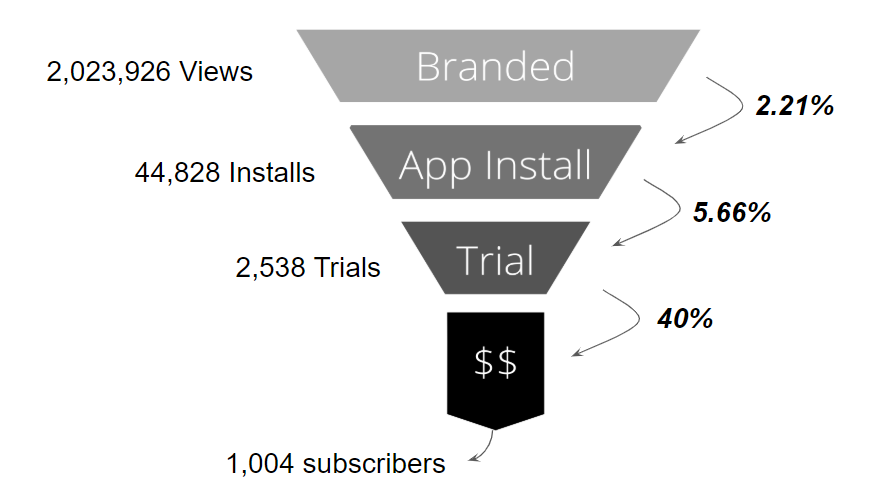

# Facebook Sponsored Content Ad Performance 

Scenario: We paid to advertise our articles on facebook to expand our brand awareness and ultimately our subscriber base. Once the user clicks on the advertised articles, we land the users on a paywalled article page which directs them to download the app and subsequently start a free trial. 

## Business goal
We want to expand the spend on the sponsored content strategy while maintaining a level of efficiency. 

## The data

Table: **Branded Content**
Page view that is generated once on a paid ad campaign

Fields | Description 
-----|------------
 platform | The type of device that the events occurred on 
 campaign_name | The name of the branded content ad campaign (typically an author name) 
 event_time | The timestamp of the branded content ad page view in epoch time 
 uid | A unique identifier for a visitor 

Table: **App Installs**
A visitor installing and opening (we don’t receive the event if the user downloads but never opens the app) the app on a mobile device.

 Fields | Description 
-----|------------
uid|A unique identifier for a visitor
device_id| A unique identifier for the device of the visitor
event_time|the timestamp of the download in epoch time
article_id|A unique identifier for the article that the visitor viewed that directed them to the app download (null means there's no article)
source|The origin of the visitor downloading the app, whether it's from an Ad or if it was organic

Table: **Checkouts**
A visitor starting a subscription, either through a direct purchase or through a free trial.

 Fields | Description 
-----|------------
device_id|A unique identifier for the device of the visitor
event_time|The timestamp of when the visitor checked out in epoch time
checkout_status|The result of the checkout, whether the visitor purchased directly or if they initiated a trial
trial_converted|A boolean flag for visitors who initiated trials if they eventually converted to a paid subscription at the end of the trial (7 days after trial start)

## The findings
* iPhone users start trials at a rate that's more than double than Android users
* 95% of subscribers that have converted come from trials as opposed to a direct purchase
* We see a 20% increase in trials when advertising on a Tuesday and a -28% decrease in conversions when advertising on weekends.
* We see a 37.6% boost in conversions at 12pm, yet we only advertise at noon only 3.4% of the time.
* We spotted 3 dates that were outliers when analyzing the conversion rates for 'App Installs to Trial Starts' (March 11th, March 23rd and March 24th). I would imagine that it would be one of the more stable metrics.
* Author_192's articles have had well over 100,000 views yet have not reached a single conversion.
* Author_216 and Author_131 have conversion rates over 1% yet both have well under 25,000 views. See if we can continue to push these articles out.

## The funnel

